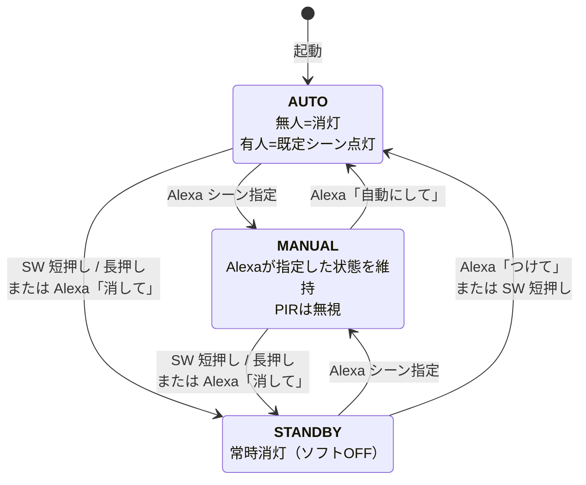

# SmartLED

> **「サイバーパンク風に光らせて」** ― そんな曖昧な言葉でも、本棚がそれっぽく光る。
> Alexa × Gemini × ESP32 × WLED で作る、自然言語で操れる DIY スマート照明。


---

## SmartLED とは

SmartLED は、ESP32 と WLED で動かす本棚 LED を 「日常の自動制御」と 「自然言語による高度な演出」の両方で扱えるようにする個人プロジェクトです。

普通のスマート照明は「ON / OFF」「色を青に」程度の定型操作しかできません。SmartLED はここに **Gemini API による自然言語解釈** を載せることで、

- 「読書に集中したい」
- 「ちょっとリラックスできる青っぽい光にして」
- 「サイバーパンク風に光らせて」

といった **曖昧な指示** を、色・輝度・WLED エフェクト ID に変換して LED に流します。
人がいないときは PIR センサーで自動点灯／自動消灯し、Alexa で指示を出せば即座に演出を上書きできます。

### このプロジェクトが目指したもの


|           |                                      |
| --------- | ------------------------------------ |
| **コンセプト** | 「決まった操作」と「気分で言う指示」を 1 つの照明で両立する      |
| **使う人**   | 自宅の本棚に DIY で組み込みたい個人                 |
| **設計思想**  | クラウドはクラウドの仕事、エッジはエッジの仕事に徹する（後述）      |
| **コスト**   | AWS / Gemini ともに可能な限り無料枠で運用できる範囲に収める |


---

## できること

### Alexa での操作例


| 発話                     | 動作                                                  |
| ---------------------- | --------------------------------------------------- |
| 「アレクサ、ライトをつけて」         | 人感センサーによる自動点灯モード（**AUTO**）に入る                       |
| 「アレクサ、ライトを消して」         | 強制消灯モード（**STANDBY**）に入る                             |
| 「アレクサ、ライトを読書モードにして」    | Gemini が解釈 → 集中しやすい暖色 Solid で点灯（**MANUAL**）         |
| 「アレクサ、ライトをサイバーパンク風にして」 | Gemini が解釈 → 紫系のアニメーションエフェクトで点灯 （**MANUAL**）        |
| 「アレクサ、ライトをリラックスする色にして」 | Gemini が解釈 → やわらかい青系の Breathe エフェクトで点灯 （**MANUAL**） |


> Gemini は WLED のエフェクト辞書（`aws/src/lib/wled-effects.json`）から **必ず許可リスト内の effectId** を返すように Structured Output で制約されているため、未知のエフェクトが選ばれることはありません。

### 物理操作

- **トグルスイッチ**：主電源の物理 ON / OFF（最優先・ソフトでは介入不可）
- **プッシュスイッチ短押し**：AUTO ↔ STANDBY のトグル
- **プッシュスイッチ長押し（2 秒）**：強制 STANDBY

### 自動制御（AUTO モードのみ）

- AM312 PIR が動体を検知 → 既定シーン（暖色 / 80%）で自動点灯
- 最終検知から **5 分** 動きがなければ自動消灯

---

## システム全体像


ポイントは **「ラウンドトリップを最小化する」** という設計思想です。


| シナリオ              | 経路                                                       | なぜ？                  |
| ----------------- | -------------------------------------------------------- | -------------------- |
| 人が部屋に入った／出た       | **ESP32 → WLED**（エッジ完結）                                  | レイテンシゼロ・無料枠を消費しない    |
| Alexa で「読書モードにして」 | Alexa → Lambda → Gemini → IoT Core (MQTT) → ESP32 → WLED | 自然言語の解釈が必要なときだけクラウドへ |


クラウドは **「自然言語を LED パラメータに翻訳する係」** に徹し、エッジは **「現場でリアルタイムに反応する係」** に徹する、という役割分担になっています。

### 主要コンポーネント


| 区分       | コンポーネント                   | 役割                                          |
| -------- | ------------------------- | ------------------------------------------- |
| **クラウド** | Amazon Alexa Custom Skill | 音声 → インテント変換                                |
|          | AWS Lambda (TypeScript)   | Alexa リクエスト処理・Gemini 呼び出し・MQTT 発行           |
|          | Gemini API                | 自然言語 → LED パラメータ（色・輝度・effectId）             |
|          | AWS IoT Core              | MQTT ブローカー（永年無料枠の範囲で運用）                     |
|          | AWS SSM Parameter Store   | Gemini API キーの安全な保管（SecureString）           |
| **エッジ**  | ESP32 #1（ブリッジ）            | MQTT Subscribe / PIR / SW / WLED への HTTP 転送 |
|          | ESP32 #2（WLED サーバ）        | WLED ファーム書き込み済み・LED ドライブ                    |
|          | AM312 PIR                 | 人感センサー                                      |
|          | プッシュ SW / トグル SW          | モード切替 / 物理電源                                |
|          | WS2812B LED テープ           | アドレス指定可能な本棚照明                               |


---

## ハードウェア構成


- **主電源**：MEAN WELL LRS-75-5（5V 15A）
- **過電流保護**：LED 系統ごとに **5A ヒューズ**（物理）＋ WLED の ABL を **4250 mA**（5A の 15% マージン）に制限（ソフト）
- **ESP32 ブリッジの GPIO**
  - `GPIO 13`：プッシュ SW（`INPUT_PULLUP`）
  - `GPIO 27`：AM312 PIR（`INPUT`）

> 詳細な BOM・電気的な制約・ABL の運用ルールは `[docs/requirements.md](docs/requirements.md)` §3〜§4 を参照してください。

---

## 3 つの動作モード

ESP32 ブリッジは常に **AUTO / MANUAL / STANDBY** のいずれかで動きます。




| モード         | PIR | Alexa シーン指定   | 短押し       | 長押し（2 秒）  |
| ----------- | --- | ------------- | --------- | --------- |
| **AUTO**    | 有効  | 受付 → MANUAL へ | STANDBY へ | STANDBY へ |
| **MANUAL**  | 無視  | 受付（上書き）       | STANDBY へ | STANDBY へ |
| **STANDBY** | 無視  | 受付 → MANUAL へ | AUTO へ復帰  | （無効）      |


> 設計思想は **「ユーザーが今この瞬間に下した明示的な指示が、常に勝つ」**。詳細な遷移条件と優先順位は `[docs/requirements.md](docs/requirements.md)` §7 を参照してください。

---

## リポジトリ構成

```text
SmartLED/
├── aws/                     # AWS バックエンド (CDK + Lambda + TypeScript)
│   ├── bin/                 # CDK エントリポイント
│   ├── lib/                 # CDK スタック定義
│   ├── src/
│   │   ├── handlers/        # Alexa ハンドラ Lambda
│   │   └── lib/             # Gemini クライアント / WLED エフェクト辞書
│   └── README.md            # バックエンドのデプロイ手順
├── esp32/                   # ESP32 ブリッジ (PlatformIO + Arduino C++)
│   ├── src/main.cpp         # PIR / SW / MQTT / WLED 制御の本体
│   ├── include/config.h.example
│   └── secrets/certs.h.example
├── docs/
│   ├── requirements.md      # 仕様書
│   ├── acceptance-checklist.md  # 受け入れ確認用チェックリスト
│   ├── alexa/               # Alexa スキルの interaction model
│   └── diagrams/            # システム構成図 / 回路図
└── .cursor/rules/           # AI エージェント向け開発ルール
```

---

## クイックスタート

> このセクションは「だいたいこの順番で進む」というガイドです。実際にビルド・デプロイするときは、各ディレクトリの README と `[docs/acceptance-checklist.md](docs/acceptance-checklist.md)` のチェックリストを順番に進めてください。

### 1. AWS バックエンド

```powershell
cd aws
npm ci

# Gemini API キーを SSM に保存（初回のみ）
aws ssm put-parameter --name "/smartled/gemini-api-key" `
  --value "YOUR_GEMINI_API_KEY" --type "SecureString"

# CDK でデプロイ
$env:CDK_DEFAULT_REGION  = "ap-northeast-1"
$env:CDK_DEFAULT_ACCOUNT = (aws sts get-caller-identity --query Account --output text)
npx cdk deploy SmartLED-IoTBackend
```

詳細：`[aws/README.md](aws/README.md)`

### 2. ESP32 ブリッジ（1 台目）

```bash
cd esp32
cp include/config.h.example include/config.h            # WiFi / WLED_IP を記入
cp secrets/certs.h.example   secrets/certs.h            # AWS IoT 証明書を貼り付け
pio run -e smartled -t upload
pio device monitor -b 115200
```

### 3. WLED（2 台目の ESP32）

WLED 公式手順で 2 台目の ESP32 にファームを書き込み、Web UI から WiFi と IP を設定。
1 台目の `config.h` の `WLED_IP` を更新して再書き込み。

### 4. Alexa スキル

`[docs/alexa/README.md](docs/alexa/README.md)` の手順に従って Alexa Developer Console で:

1. Custom Skill を作成（ja-JP / Backend: Provision your own）
2. `docs/alexa/interaction-model.ja-JP.json` を JSON Editor に貼って Build
3. Endpoint に Lambda の ARN を設定
4. CDK を `-c alexaSkillId=<スキルID>` 付きで再デプロイ

### 5. 動作確認

`[docs/acceptance-checklist.md](docs/acceptance-checklist.md)` の **第5章 E2E** を一通り実施。

---

## 技術スタック


| レイヤー     | 採用技術                                     |
| -------- | ---------------------------------------- |
| 音声 IF    | Amazon Alexa Custom Skill                |
| 自然言語解釈   | Google Gemini API（Structured Output）     |
| クラウド実行   | AWS Lambda（Node.js 22 / TypeScript）      |
| メッセージング  | AWS IoT Core（MQTT over TLS）              |
| 機密情報管理   | AWS SSM Parameter Store（SecureString）    |
| IaC      | AWS CDK v2（TypeScript）                   |
| エッジ      | ESP32（Arduino フレームワーク + PlatformIO）      |
| LED ファーム | [WLED](https://kno.wled.ge/) 0.14+       |
| LED ハード  | WS2812B / MEAN WELL LRS-75-5 / AM312 PIR |


---

## ドキュメントマップ


| ドキュメント                                                         | 用途                             |
| -------------------------------------------------------------- | ------------------------------ |
| **本 README**                                                   | プロジェクトの概要・コンセプト把握              |
| `[docs/requirements.md](docs/requirements.md)`                 | **真実のソース**：仕様・制約・状態機械・MQTT・省電力 |
| `[docs/acceptance-checklist.md](docs/acceptance-checklist.md)` | ビルド・デプロイ・動作確認の手順チェックリスト        |
| `[aws/README.md](aws/README.md)`                               | AWS バックエンドのデプロイ手順              |
| `[docs/alexa/README.md](docs/alexa/README.md)`                 | Alexa スキルの登録手順                 |


---

## ライセンス

[MIT License](LICENSE) © 2026 Y.Ohara