# SmartLED

> **「サイバーパンク風に光らせて」** ― そんな曖昧な言葉でも、本棚がそれっぽく光る。
> Alexa × Gemini × ESP32 × WLED で作る、声で操れる DIY スマート照明。

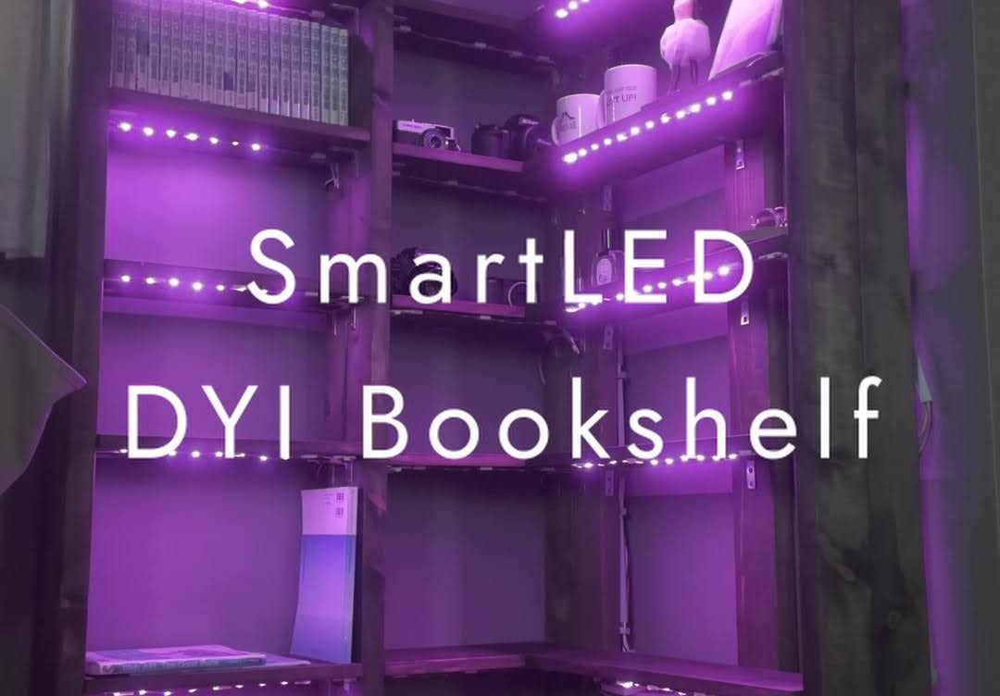


---

## SmartLED とは

SmartLED は、本棚の LED を **「人がいるとき自動で光る」** と **「声で好きな雰囲気を指示できる」** の両方を実現する個人 DIY プロジェクトです。

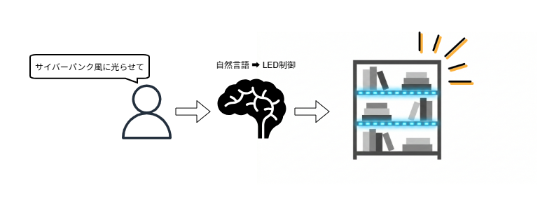

普通のスマート照明は「ON / OFF」「色を青に」程度の決まった操作しかできません。SmartLED はここに **Gemini API** を組み合わせることで、

- 「読書に集中したい」
- 「ちょっとリラックスできる青っぽい光にして」
- 「サイバーパンク風に光らせて」

といったざっくりした言葉を、色・明るさ・エフェクトに変換して LED に反映できます。

### プロジェクトの概要


|           |                                         |
| --------- | --------------------------------------- |
| **コンセプト** | 「決まった操作」と「気分で言う指示」を 1 つの照明で両立する         |
| **対象**    | 自宅の本棚に自作で組み込みたい個人                       |
| **設計方針**  | PIR の自動点灯はローカル完結・AI 解釈が必要なときだけクラウドへ（後述） |
| **コスト**   | AWS / Gemini ともに永年無料枠の範囲で運用できるよう設計      |


---

## できること

### Alexa での操作

Alexa に話しかけるには、まず **「アレクサ、ライトコントロールを開いて」** とスキルを呼び出します。その後に続けて指示するか、スキルが起動した状態で改めて話しかけてください。

> 例: 「アレクサ、ライトコントロールを開いて」→（スキル起動）→「読書モードにして」


| 発話例                | 何が起きるか                                      |
| ------------------ | ------------------------------------------- |
| 「ライトをつけて」          | 人感センサーで自動点灯するモード（**AUTO**）に切り替わる            |
| 「ライトを消して」          | 消灯して待機状態（**STANDBY**）に入る                    |
| 「ライトを読書モードにして」     | Gemini が解釈 → 集中しやすい暖色・Solid で点灯（**MANUAL**） |
| 「ライトをサイバーパンク風にして」  | Gemini が解釈 → 紫系のアニメーションエフェクトで点灯             |
| 「ライトをリラックスできる色にして」 | Gemini が解釈 → やわらかい青系の Breathe エフェクトで点灯      |


> Gemini が返すエフェクトは、あらかじめ登録した辞書（`aws/src/lib/wled-effects.json`）の中からしか選ばれません。想定外のエフェクトが出ることはありません。

### 物理ボタンでの操作

- **トグルスイッチ**：主電源の物理 ON / OFF（すべてに優先する・ソフトでは介入不可）
- **プッシュスイッチ短押し**：AUTO ↔ STANDBY の切り替え
- **プッシュスイッチ長押し（2 秒）**：強制消灯（STANDBY）

### センサーによる自動点灯（AUTO モードのみ）

- AM312 PIR が動きを検知 → 暖色・明るさ 80% で自動点灯
- 最後に動きを検知してから **5 分** 経つと自動消灯

---

## システム全体像

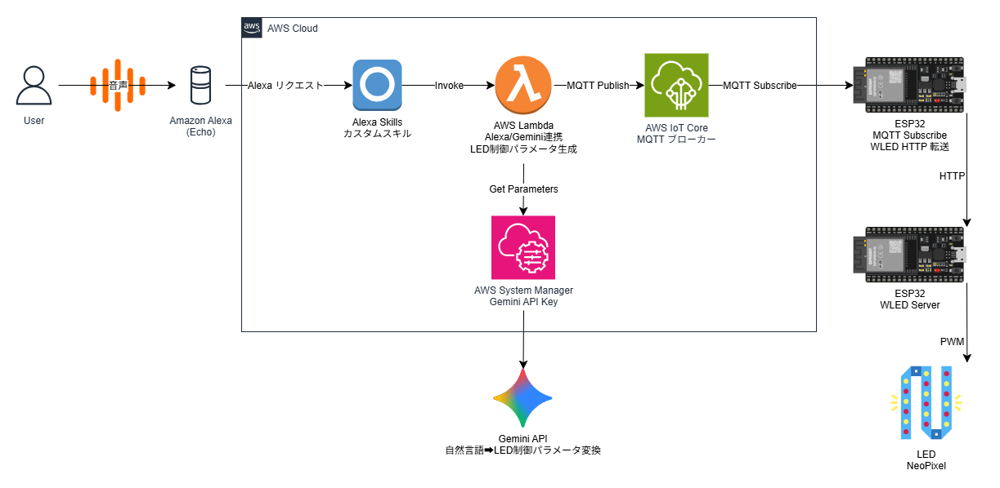

### 2 つの動作フロー

SmartLED には「声で操作するルート」と「センサーで自動制御するルート」があります。

**声で操作するとき（Alexa → WLED）**

```
Alexa → AWS Lambda → Gemini API
     ↓
  AWS IoT Core (MQTT)
     ↓
  ESP32 ブリッジ → WLED → LED
```

自然言語を LED のパラメータに変換する必要があるため、クラウドを経由します。

**センサーで自動制御するとき（PIR → WLED）**

```
AM312 PIR → ESP32 ブリッジ → WLED → LED
```

クラウドは通らず、ローカルだけで完結します。
Alexa の無料枠を消費しないことと、応答が速いことが理由です。

### 主要コンポーネント


| 区分       | コンポーネント                   | 役割                                     |
| -------- | ------------------------- | -------------------------------------- |
| **クラウド** | Amazon Alexa Custom Skill | 声 → 命令の変換                              |
|          | AWS Lambda (TypeScript)   | Alexa のリクエスト処理・Gemini 呼び出し・MQTT 送信     |
|          | Gemini API                | 自然言語 → LED パラメータ（色・明るさ・エフェクト ID）       |
|          | AWS IoT Core              | MQTT ブローカー（Lambda と ESP32 をつなぐ）        |
|          | AWS SSM Parameter Store   | Gemini API キーの保管                       |
| **エッジ**  | ESP32 #1（ブリッジ）            | MQTT 受信 / PIR・SW の監視 / WLED への HTTP 転送 |
|          | ESP32 #2（WLED サーバ）        | LED の実際の点灯・エフェクト制御                     |
|          | AM312 PIR                 | 人感センサー                                 |
|          | プッシュ SW / トグル SW          | モード切替 / 物理電源                           |
|          | WS2812B LED テープ           | 本棚の照明                                  |


---

## なぜ ESP32 を 2 台構成にしたか

**1 台目（ブリッジ）でやること**

- AWS IoT Core への MQTT 接続（TLS 証明書管理が必要）
- PIR センサー・プッシュスイッチの監視
- WLED への HTTP 転送

**2 台目（WLED サーバ）でやること**

- LED テープの実際の点灯・エフェクト制御

この 2 つを 1 台にまとめることは技術的には可能ですが、**WLED を公式リポジトリそのままで使う** ことでコードの自作コストを大幅に減らせます。WLED はカラフルなエフェクト・明るさ制御・Web UI による手動操作などを無料で提供している成熟したファームウェアです。これを独自ファームに組み込もうとすると実装コストが跳ね上がるため、「WLED 専用機を 1 台用意して HTTP で叩く」という構成を選んでいます。

また、WLED 側の設定（LED の本数・配線・最大電流など）を Web UI から独立して変更できるメリットもあります。

---

## ハードウェア構成

### 本棚の設計図

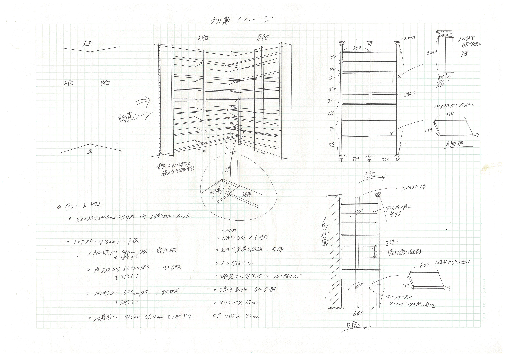

### 回路図

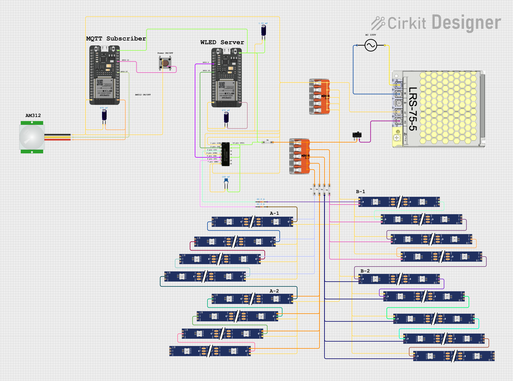

- **主電源**：MEAN WELL LRS-75-5（5V 15A）
- **過電流保護**：LED 系統ごとに **5A ヒューズ**（物理）＋ WLED の電流リミッターを **4250 mA** に設定（5A の 15% 安全マージン）
- **ESP32 ブリッジの GPIO**
  - `GPIO 13`：プッシュ SW（`INPUT_PULLUP`）
  - `GPIO 27`：AM312 PIR（`INPUT`）

> 詳しい部品表・配線・電流制限の運用方法は [docs/requirements.md](docs/requirements.md) §3〜§4 を参照してください。

---

## 3 つの動作モード

ESP32 ブリッジは常に **AUTO / MANUAL / STANDBY** のいずれかで動いています。

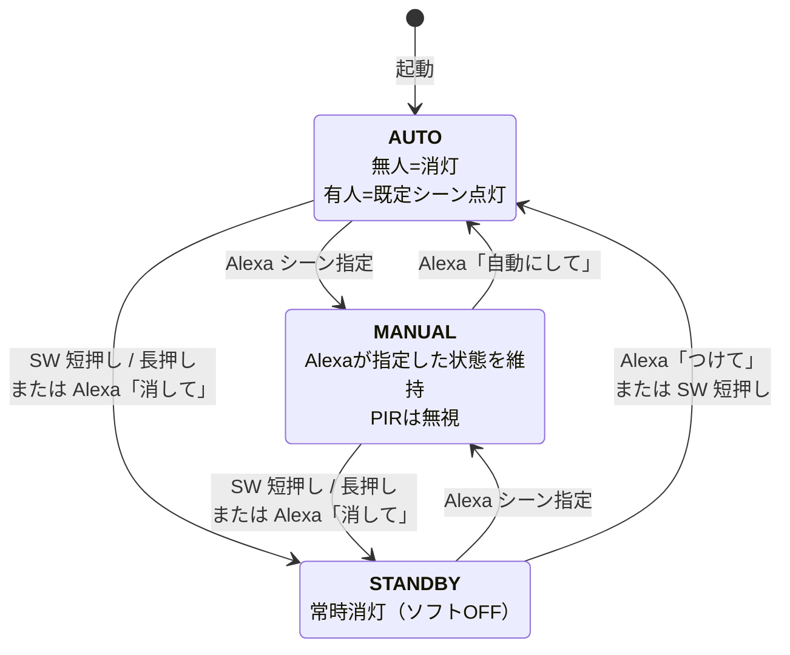


| モード         | PIR | Alexa シーン指定   | 短押し       | 長押し（2 秒）  |
| ----------- | --- | ------------- | --------- | --------- |
| **AUTO**    | 有効  | 受付 → MANUAL へ | STANDBY へ | STANDBY へ |
| **MANUAL**  | 無視  | 受付（上書き）       | STANDBY へ | STANDBY へ |
| **STANDBY** | 無視  | 受付 → MANUAL へ | AUTO へ復帰  | （無効）      |


> 基本的な考え方は **「今まさに出した指示が一番強い」**。詳しい優先順位は [docs/requirements.md](docs/requirements.md) §7 を参照してください。

---

## リポジトリ構成

```text
SmartLED/          ← このリポジトリ
├── aws/                     # AWS バックエンド (CDK + Lambda + TypeScript)
│   ├── bin/                 # CDK エントリポイント
│   ├── lib/                 # CDK スタック定義
│   ├── src/
│   │   ├── handlers/        # Alexa ハンドラ Lambda
│   │   └── lib/             # Gemini クライアント / WLED エフェクト辞書
│   └── README.md            # バックエンドのデプロイ手順
├── esp32/                   # ESP32 ブリッジ (PlatformIO + Arduino C++)
│   ├── src/main.cpp         # PIR / SW / MQTT / WLED 制御の本体
│   ├── include/config.h.example
│   └── secrets/certs.h.example
├── docs/
│   ├── requirements.md      # 仕様書
│   ├── acceptance-checklist.md  # 受け入れ確認チェックリスト
│   ├── alexa/               # Alexa スキルの interaction model
│   └── diagrams/            # システム構成図 / 回路図 / 写真
└── .cursor/rules/           # AI エージェント向け開発ルール

WLED/              ← WLED 公式リポジトリを別途クローン（このリポジトリには含まない）
                     https://github.com/Aircoookie/WLED
                     2 台目の ESP32 に書き込む LED 制御ファームウェア
```

> **WLED について:** ESP32 #2（WLED サーバ）に書き込むファームウェアは、[WLED 公式リポジトリ](https://github.com/Aircoookie/WLED) を別途クローンしてビルドします。このリポジトリには含まれていません。詳細は [docs/acceptance-checklist.md](docs/acceptance-checklist.md) 第3章を参照してください。

---

## クイックスタート

> 「だいたいこの順番で進む」というガイドです。実際の手順は各ディレクトリの README と [docs/acceptance-checklist.md](docs/acceptance-checklist.md) のチェックリストを参照してください。

### 1. AWS バックエンド

```powershell
cd aws
npm ci

# Gemini API キーを SSM に保存（初回のみ）
aws ssm put-parameter --name "/smartled/gemini-api-key" `
  --value "YOUR_GEMINI_API_KEY" --type "SecureString"

# CDK でデプロイ
$env:CDK_DEFAULT_REGION  = "ap-northeast-1"
$env:CDK_DEFAULT_ACCOUNT = (aws sts get-caller-identity --query Account --output text)
npx cdk deploy SmartLED-IoTBackend
```

詳細：[aws/README.md](aws/README.md)

### 2. ESP32 ブリッジ（1 台目）

```bash
cd esp32
cp include/config.h.example include/config.h   # WiFi / WLED_IP を記入
cp secrets/certs.h.example  secrets/certs.h    # AWS IoT 証明書を貼り付け
pio run -e smartled -t upload
pio device monitor -b 115200
```

### 3. WLED（2 台目の ESP32）

WLED 公式リポジトリをクローンしてビルドし、2 台目の ESP32 に書き込みます。

```bash
git clone https://github.com/Aircoookie/WLED.git
# → PlatformIO でビルド・書き込み（詳細は docs/acceptance-checklist.md 第3章）
```

書き込み後に Web UI（Config → WiFi Setup）で **静的 IP を必ず設定**してください。
DHCP のままにすると再起動のたびに IP が変わり、ESP32 ブリッジからの HTTP 通信が途切れます。

1. Static IP・Gateway・Subnet を入力して **Save & Connect**
2. 設定した IP で Web UI が開くことを確認
3. `esp32/include/config.h` の `WLED_IP` を同じ値に更新して、1 台目を再書き込み

> 詳細な手順と注意事項（IP 競合の避け方など）は [docs/acceptance-checklist.md](docs/acceptance-checklist.md) 第3章を参照。

### 4. Alexa スキル

[docs/alexa/README.md](docs/alexa/README.md) の手順に従って Alexa Developer Console で:

1. Custom Skill を作成（ja-JP / Backend: Provision your own）
2. `docs/alexa/interaction-model.ja-JP.json` を JSON Editor に貼って Build
3. Endpoint に Lambda の ARN を設定
4. CDK を `-c alexaSkillId=<スキルID>` 付きで再デプロイ

### 5. 動作確認

[docs/acceptance-checklist.md](docs/acceptance-checklist.md) の **第5章 E2E** を一通り実施。

---

## 技術スタック


| レイヤー     | 採用技術                                     |
| -------- | ---------------------------------------- |
| 音声 IF    | Amazon Alexa Custom Skill                |
| 自然言語解釈   | Google Gemini API（Structured Output）     |
| クラウド実行   | AWS Lambda（Node.js 22 / TypeScript）      |
| メッセージング  | AWS IoT Core（MQTT over TLS）              |
| 機密情報管理   | AWS SSM Parameter Store（SecureString）    |
| IaC      | AWS CDK v2（TypeScript）                   |
| エッジ      | ESP32（Arduino フレームワーク + PlatformIO）      |
| LED ファーム | [WLED](https://kno.wled.ge/) 0.14+       |
| LED ハード  | WS2812B / MEAN WELL LRS-75-5 / AM312 PIR |


---

## ドキュメントマップ


| ドキュメント                                                       | 用途                                 |
| ------------------------------------------------------------ | ---------------------------------- |
| **本 README**                                                 | プロジェクトの概要・コンセプト把握                  |
| [docs/requirements.md](docs/requirements.md)                 | 仕様書（状態機械・MQTT・省電力・電気的制約など細かい仕様はここ） |
| [docs/acceptance-checklist.md](docs/acceptance-checklist.md) | ビルド・デプロイ・動作確認の手順チェックリスト            |
| [aws/README.md](aws/README.md)                               | AWS バックエンドのデプロイ手順                  |
| [docs/alexa/README.md](docs/alexa/README.md)                 | Alexa スキルの登録手順                     |


---

## ライセンス

[MIT License](LICENSE) © 2026 Y.Ohara

---

## Appendix: 制作過程

> 組み立て・配線・実装の様子です。

### 本棚の加工


|               |                   |
| ------------- | ----------------- |
| 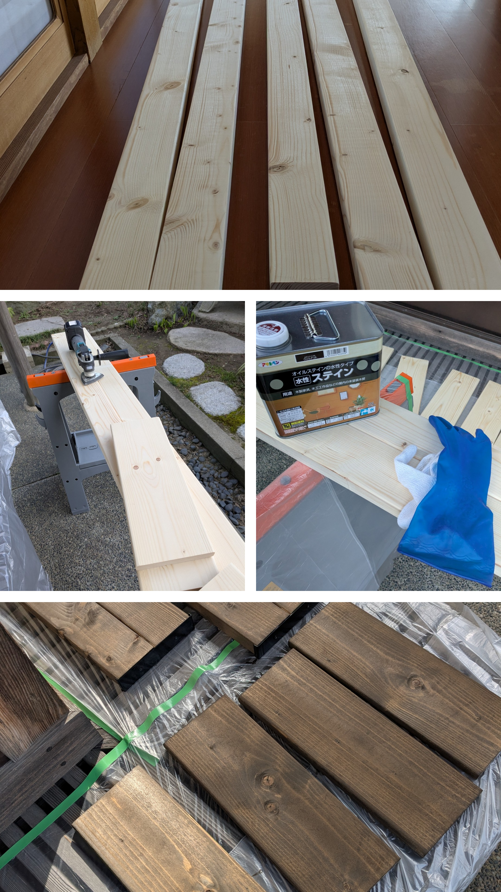 | 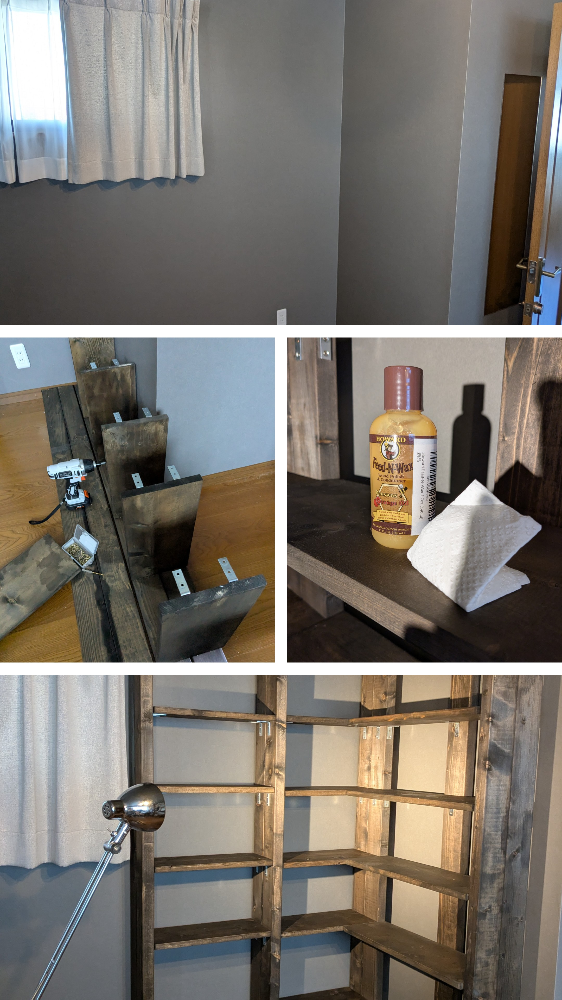 |


### 回路作成・3Dプリンタによる筐体と治具作成


|                    |
| ------------------ |
| 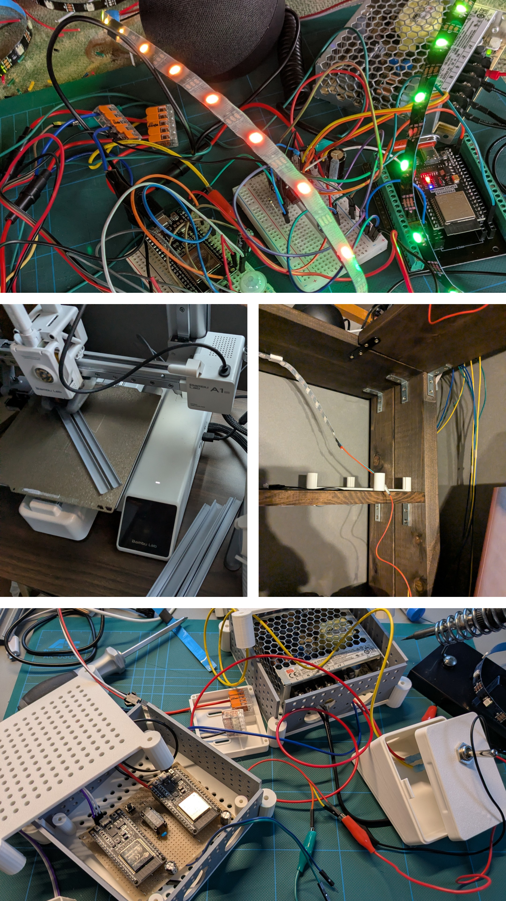 |


### 点灯テスト・動作確認


|              |                    |
| ------------ | ------------------ |
| 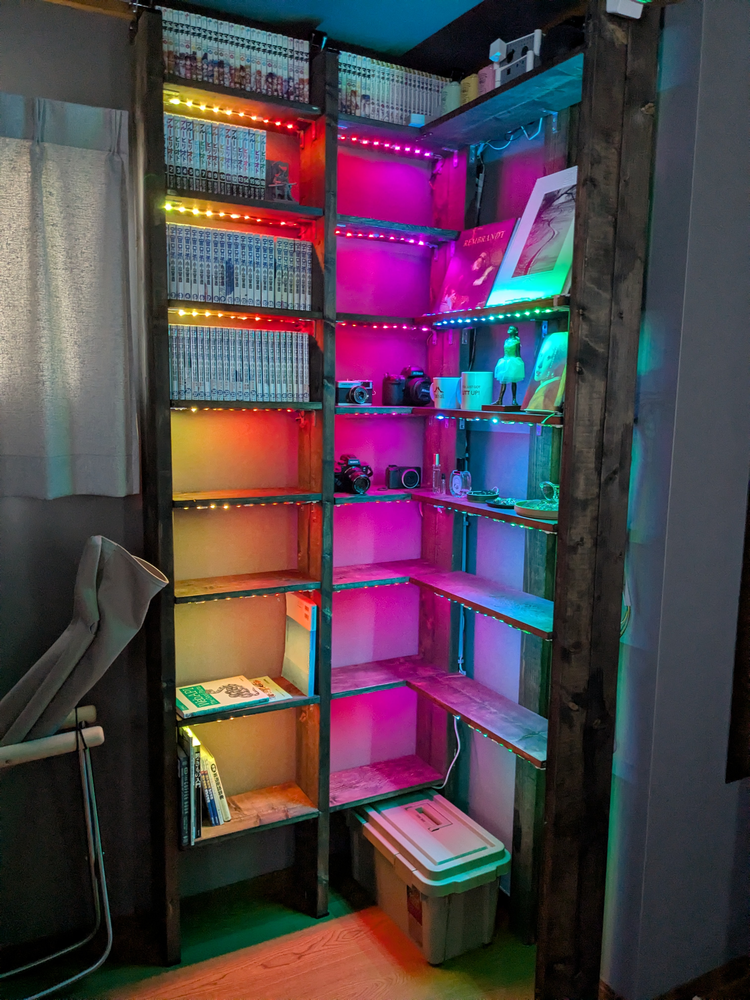 | 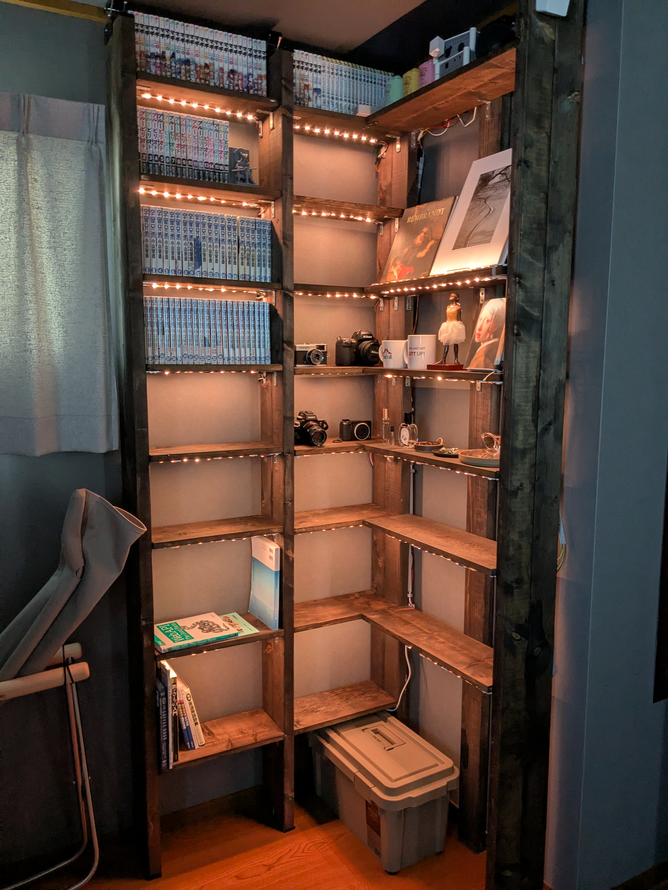 |
