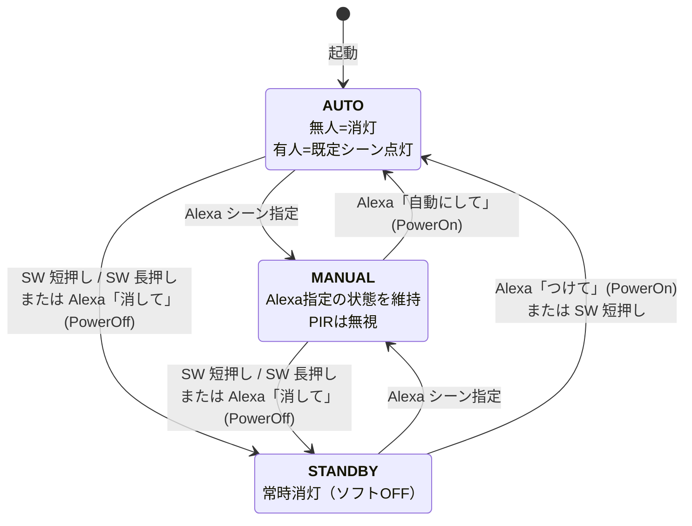
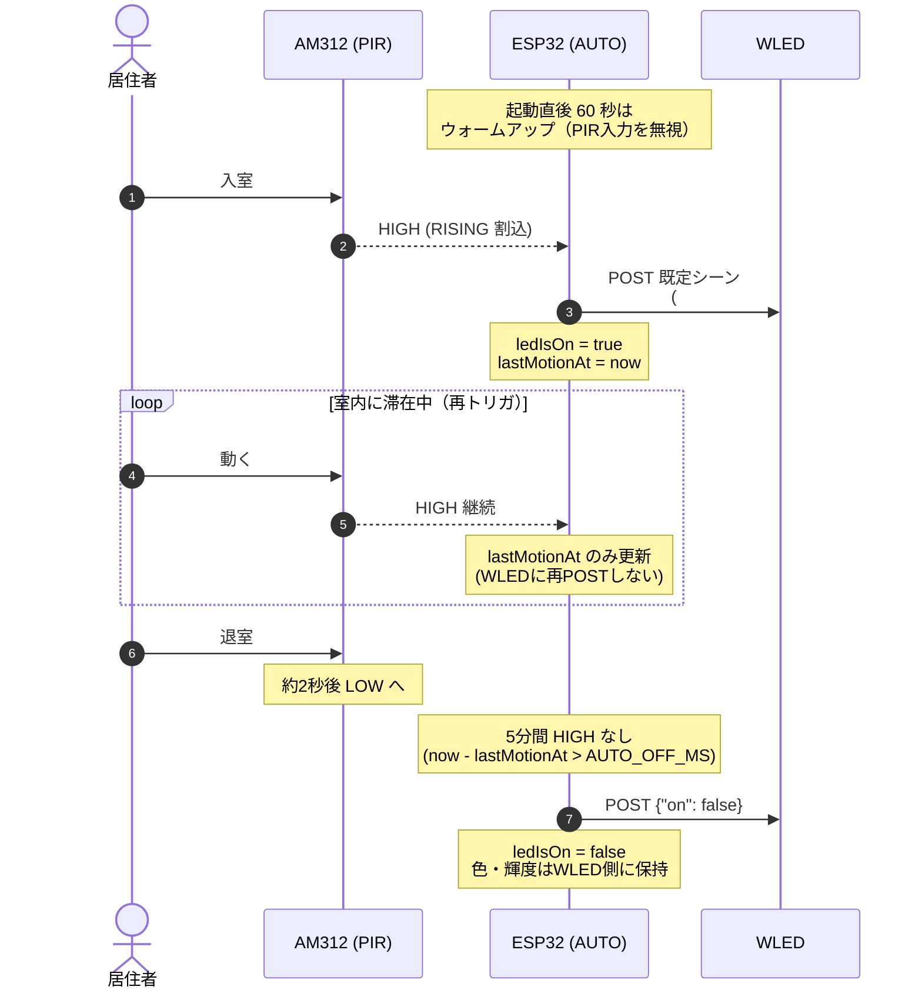

# ESP32 LED Bookshelf IoT Control System (要件定義書)

## 1. プロジェクトの目的

本プロジェクトは、日常的な自動制御と、自然言語を通じた高度な演出を両立する「DIYスマート本棚」を構築することを目的とする。

## 2. 背景・解決する課題

- 通常のLED照明では、単調な点灯・消灯しかできず、空間の演出性に欠ける。
- 音声アシスタント（Alexa）による定型操作だけでなく、「読書に集中したい」「リラックスできる青っぽい光にして」といった曖昧な指示（自然言語）をGemini APIで解釈し、動的にライティングへ反映させる体験を実現する。

## 3. BOM（部品表・前提ハードウェア）


| 区分          | 部品                      | 仕様・型番例                                                                | 備考                                                                    |
| ----------- | ----------------------- | --------------------------------------------------------------------- | --------------------------------------------------------------------- |
| マイコン        | ESP32 ×2                | ESP32-DevKitC など                                                      | 1台目=ブリッジ（AWS IoT サブスクライブ＋WLED へ HTTP）／2台目=WLED ファーム書き込み済み             |
| 照明          | アドレス指定可能 LED テープ        | WS2812B 等                                                             | 系統あたり最大 4250mA に制限（§4 参照）                                             |
| 人感センサー（PIR） | **AM312**（小型 PIR モジュール） | 動作電圧 2.7V〜12V（3.3V/5V いずれでも可）／デジタル出力／出力 HIGH ホールド約 2 秒（固定・調整不可）／再トリガ式 | ブリッジ ESP32 の `PIR_PIN`（**GPIO 27**）に接続。電源投入後 **約 60 秒のウォームアップ期間** が必要 |
| 物理電源スイッチ    | トグルスイッチ                 | 定格 5A 以上（推奨 10A 以上）                                                   | 主電源 5V ライン上流に挿入。OFF で全システム遮断（ハードウェア）                                  |
| 制御スイッチ      | モーメンタリプッシュスイッチ          | タクトスイッチ 6×6mm 等                                                       | ブリッジ ESP32 の `MODE_BTN_PIN`（**GPIO 13**）↔ GND。`INPUT_PULLUP` で使用      |
| 主電源         | MEAN WELL LRS-75-5      | 5V 15A / 75W                                                          |                                                                       |
| 過電流保護（物理）   | ガラス管／平型ヒューズ             | LED 系統ごとに 5A                                                          | §4 参照                                                                 |
| ファームウェア     | WLED                    | 0.14 以降                                                               | またはMQTT通信可能なカスタムファームウェア                                               |


## 4. ハードウェア制約と安全仕様（BOM準拠）

> この仕様はすべてのAI生成コード・設定値に強制適用される。

- **主電源:** MEAN WELL LRS-75-5（5V 15A 容量）
- **過電流保護（物理）:** LED系統ごとに **5A** のガラス管ヒューズ（または平型ヒューズ）を挿入すること。
- **過電流保護（ソフトウェア）:** WLEDのABL（Automatic Brightness Limiter）機能を用いて、1ポート（1系統）あたりの最大電流値を **4250mA**（5Aヒューズに対して15%の安全マージン）に制限すること。これにより、突入電流や瞬間的な全白点灯時でも5Aヒューズの溶断を防ぐ。
- **AIコード生成の禁止事項:** `abl.mA` が **4250** を超える値を含む設定JSON、コード、提案を生成してはならない。
- **ABL の運用とブリッジの役割:**
  1. **初回／メンテ時（手順）:** WLED Web UI の LED 設定で、ABL（電流上限）が **4250mA 以下**であることを確認する。複数バスがある場合はバスごとの設定も含め、§4 を満たすこと。
  2. **起動時の自動同期:** ブリッジ ESP32 は WiFi 接続後、`POST http://<WLED_IP>/json/cfg` に `{"hw":{"led":{"maxpwr":4250}},"sv":false}` 相当の JSON を送り、WLED ランタイムの `hw.led.maxpwr` を同期する（`esp32/src/main.cpp` の `syncWledAblOnBoot()`）。`sv:false` は **cfg.json を毎回書き換えない** ための指定であり、WLED 単体再起動後は UI で設定した値が読み込まれる。ブリッジが再度起動すると RAM 上の上限は再同期される。
  3. **設定の無効化・変更:** `config.h` の `WLED_SYNC_ABL_ON_BOOT`（0 で無効）、`WLED_ABL_MAX_MILLIAMPS`（既定 4250、上限はコード側で 4250 にクランプ）を参照すること。
  4. **失敗時:** WLED の AP ロック・設定 PIN・IP 誤り・WLED 未起動では HTTP が失敗する。シリアルログ `[WLED] ABL sync` を確認し、(1) の手順で UI から修正する。

## 5. システムアーキテクチャとデータフロー

システムは、エッジデバイス（ESP32）とクラウド（AWS）のハイブリッド構成をとる。

1. **日常制御フロー（エッジ完結・PIR）:**
  - ブリッジ ESP32 が PIR の HIGH を検知（モード=AUTO のときのみ有効）
  - ESP32 は WLED の `/json/state` に直接 HTTP POST し、`PIR_DEFAULT_`* の固定シーンで点灯
  - 最終検知から `AUTO_OFF_MS`（既定 5 分）経過で消灯（同様に WLED へ HTTP POST）
  - **AWS をラウンドトリップさせない**（無料枠保護とレイテンシ最小化のため）
2. **高度演出フロー（Alexa＋Gemini）:**
  - ユーザー発話 -> Amazon Alexa Custom Skill
  - Alexa -> AWS Lambda (TypeScript) にリクエスト送信
  - AWS Lambda -> Gemini API に自然言語を渡し、最適なLEDパラメータ（色、エフェクト、輝度、effectId）を Structured Output で取得
  - AWS Lambda -> AWS IoT Core (MQTT) へ制御メッセージをパブリッシュ（トピック: `smartled/esp32/control`）
  - AWS IoT Core -> ESP32 (MQTT Subscriber) がメッセージを受信し、WLED の JSON API を叩いて状態を変更
  - 同時に ESP32 のモードを **MANUAL** に遷移（PIR を無効化し Alexa 指定状態を保持）
3. **電源・モード制御フロー:**
  - 物理電源（トグルSW）OFF: DC 5V ライン物理遮断 → 全システム停止
  - 物理電源 ON: ESP32 起動 → 既定モード `AUTO` で開始
  - プッシュSW 短押し: AUTO ↔ STANDBY のトグル
  - プッシュSW 長押し（2 秒）: 強制 STANDBY（消灯維持）
  - Alexa `PowerOnIntent` / `PowerOffIntent`: モードを AUTO / STANDBY に遷移（MQTT トピック `smartled/esp32/mode`）

## 6. Monorepoディレクトリ構造

```text
project-root/
├── .cursor/               # Cursorエディタ用設定・ルール
├── docs/                  # 仕様書、設計ドキュメント
│   ├── diagrams/          # システム構成図など（.drawio / エクスポート画像）
│   └── requirements.md
├── aws/                   # AWSクラウドバックエンド (CDK / Lambda)
│   ├── bin/               # CDKエントリーポイント
│   ├── lib/               # CDKスタック定義
│   ├── src/
│   │   ├── handlers/      # Lambda エントリーポイント (TypeScript)
│   │   └── lib/           # 共通ライブラリ + WLED エフェクト辞書 (wled-effects.json)
│   └── package.json
└── esp32/                 # エッジデバイス用コード (Arduino / PlatformIO)
    ├── src/
    └── platformio.ini
```

---

## 7. 制御モードと優先順位（State Machine）

### 7.1 モード定義


| モード         | 既定動作                  | PIR          | Alexa シーン指定     | プッシュSW 短押し | プッシュSW 長押し(2s) |
| ----------- | --------------------- | ------------ | --------------- | ---------- | -------------- |
| **AUTO**    | 無人時=消灯 / 検知時=既定シーンで点灯 | **有効**       | 受付 → MANUAL へ遷移 | STANDBY へ  | STANDBY へ      |
| **MANUAL**  | Alexa が指定した最終状態を維持    | **無視（ログのみ）** | 受付（パラメータ上書き）    | STANDBY へ  | STANDBY へ      |
| **STANDBY** | 常時消灯（ソフトOFF）          | **無視（ログのみ）** | 受付 → MANUAL へ復帰 | AUTO へ復帰   | （無効）           |


- 起動時の既定モードは **AUTO**。
- モード状態は ESP32 RAM 上で保持（再起動で AUTO に戻る）。
- Lambda は最新モードを MQTT トピック `smartled/esp32/mode` に publish し、ESP32 が subscribe する。

### 7.2 優先順位ルール（上位が常に勝つ・決定論的）

1. **トグルSW OFF**（物理遮断・最優先・ソフト介入不可）
2. **プッシュSW 長押し**（強制 STANDBY）
3. **Alexa `PowerOn` / `PowerOff` インテント**（モード遷移）
4. **Alexa `LightControlIntent`（自然言語）**（MANUAL に遷移しつつシーン上書き）
5. **プッシュSW 短押し**（AUTO ↔ STANDBY トグル）
6. **PIR**（AUTO モードのときのみ有効）
7. **WLED Web UI からの直接操作**（運用者デバッグ用扱い・規定外）

> 設計意図: 「ユーザーが今この瞬間に下した明示的な指示」を上位に置き、PIR は最も弱い裏方とする。物理操作と Alexa が競合する場合は「より直前の操作」が常に勝つ（モード遷移＋上書き）。

### 7.3 モード遷移図（全モード × 全契機）




> 図の見方: 各モードに**1つ以上の入り口と出口**を必ず持つ。SW 短押しは「AUTO/MANUAL のときは消す」「STANDBY のときは復帰」の意味的トグル。Alexa シーン指定は **どのモードからでも** MANUAL に強制遷移する。

---

## 8. 物理スイッチ・PIR センサー仕様

### 8.0 ブリッジ ESP32 GPIO 割り当て一覧（公式）


| ピン      | マクロ名           | 用途               | 入力モード          |
| ------- | -------------- | ---------------- | -------------- |
| GPIO 13 | `MODE_BTN_PIN` | プッシュスイッチ（モード切替）  | `INPUT_PULLUP` |
| GPIO 27 | `PIR_PIN`      | AM312 PIR センサー出力 | `INPUT`        |


> Strapping ピン（GPIO 0/2/5/12/15）および ADC2 系列（WiFi 利用時に競合）への割り当ては禁止する。
> 上記ピンは `esp32/include/config.h` で定義し、ハードウェア実装と必ず一致させること。

### 8.1 トグルスイッチ（主電源）

- 主電源 DC 5V ラインの上流に挿入し、ON/OFF で全システムへの通電を物理的に切り替える。
- 定格は **5A 以上必須**（推奨 10A 以上）。LED 全白点灯時の突入電流に耐えるマージンを取ること。
- ソフトウェアで状態検出も制御も行わない（できない）。

### 8.2 プッシュスイッチ（モーメンタリ・モード制御用）


| 項目      | 規定                                                                                                 |
| ------- | -------------------------------------------------------------------------------------------------- |
| 接続      | ブリッジ ESP32 `MODE_BTN_PIN`（**GPIO 13**）↔ GND                                                        |
| 入力モード   | `INPUT_PULLUP`（外付け抵抗不要・押下で LOW）                                                                    |
| 検知方式    | **GPIO 割り込み（CHANGE）** で立ち下がり／立ち上がり時刻を記録。ISR 内では `volatile` フラグと `millis()` のみ。HTTP/MQTT/Serial は禁止 |
| デバウンス   | ISR で記録した時刻と直前の状態を `loop()` 側 100 ms 周期で評価し、30 ms 連続 LOW で押下確定                                     |
| 短押し判定   | 押下確定 → 立ち上がりまで 50 ms〜2000 ms（離した瞬間に発火）                                                             |
| 長押し判定   | LOW を 2000 ms 継続した瞬間に 1 回だけ発火（リピートしない）                                                             |
| ダブルクリック | 当面実装しない                                                                                            |


#### イベント → モード遷移の早見表


| 操作       | AUTO のとき  | MANUAL のとき | STANDBY のとき |
| -------- | --------- | ---------- | ----------- |
| 短押し      | → STANDBY | → STANDBY  | → AUTO      |
| 長押し（2 秒） | → STANDBY | → STANDBY  | （無効）        |


> 詳細な状態遷移は §7.3 の図を参照。デバウンス／長押し判定の実装規約は `.cursor/rules/200-esp32-device.mdc` を参照すること。

### 8.3 PIR センサー（AM312）


| 項目               | 規定                                                                                          |
| ---------------- | ------------------------------------------------------------------------------------------- |
| 型番               | AM312（小型 PIR モジュール）                                                                         |
| 接続               | ブリッジ ESP32 `PIR_PIN`（**GPIO 27**）                                                           |
| 電源               | 3.3V または 5V（AM312 は 2.7V〜12V 動作）。ESP32 の 3.3V 出力で給電可                                        |
| 入力モード            | `INPUT`（AM312 はデジタル出力なので pull は不要）                                                          |
| 検知条件             | 入力 HIGH のとき動体検知中（再トリガ式・連続検知中は HIGH 継続）                                                      |
| **ウォームアップ**      | 起動後 **60 秒間** は誤検知を避けるため PIR 入力を**無視**する（`PIR_WARMUP_MS = 60000`）                           |
| **ハードウェアホールド時間** | 約 2 秒（AM312 固定値）— ESP32 側のソフト消灯ロジックはこれより長い `AUTO_OFF_MS` で管理する                              |
| 既定シーン（点灯時）       | `color=#ffa84a`, `brightness=204`(=80%), `effect="solid"`, `effectId=0`                     |
| パラメータ可変化         | `config.h` の `PIR_DEFAULT_COLOR` / `PIR_DEFAULT_BRIGHTNESS` / `PIR_DEFAULT_EFFECT_ID` で上書き可 |
| **自動点灯トリガ**      | AUTO モードかつ点灯中フラグ OFF のときに HIGH を検出 → 既定シーンを WLED に POST し、点灯中フラグ ON＋`lastMotionAt = now`    |
| **自動消灯トリガ**      | 点灯中フラグ ON かつ最終 HIGH から `AUTO_OFF_MS`（既定 5 分=300000 ms）経過 → WLED に消灯ペイロード POST し、点灯中フラグ OFF  |
| **タイマーリセット**     | 点灯中に再度 HIGH を検出した場合は WLED に新しい POST はせず、`lastMotionAt = now` のみ更新（無人タイマーを延長）                |
| ノイズ対策            | 1 秒以内の連続立ち上がりエッジは同一イベントとみなしタイマーリセットのみ（再 POST しない）                                           |
| AUTO 以外のモード      | PIR 入力は読むがアクションは起こさない（Serial ログのみ）                                                          |
| LED 反映方式         | ESP32 が WLED `/json/state` に直接 HTTP POST（IoT Core を経由しない）                                   |
| 消灯ペイロード          | WLED の JSON API で `{"on": false}` を POST。輝度や色は維持（次回 ON 時に WLED 側の最後の状態が復元される）               |


#### PIR 自動点灯／自動消灯シーケンス（AUTO モードの典型的な1日）




> **設計意図:**
>
> - AM312 はホールド時間 2 秒固定で「人がまだ部屋にいる」状態を確実に伝えにくいので、**ESP32 側のソフトタイマー（5 分）が真の無人判定**を担う。
> - 消灯時は `{"on": false}` のみを送り、色・輝度・エフェクトは WLED 側に保持させる。次回点灯がスムーズかつ MQTT/HTTP トラフィック最小。
> - 連続検知中に WLED に何度も POST しないことで、ネットワーク負荷と ESP32 の通信時消費電力を抑える。
> - モード遷移で点灯中に AUTO → MANUAL に変わった場合、PIR タイマーは停止し、Alexa が指定したシーンを維持する（勝手に消灯しない）。詳細な遷移は §7.3。

---

## 9. MQTT トピック一覧（双方向）


| トピック                     | 方向                | QoS | Retain | ペイロード概要                                                           |
| ------------------------ | ----------------- | --- | ------ | ----------------------------------------------------------------- |
| `smartled/esp32/control` | Lambda → ESP32    | 0   | No     | `{ color, brightness, effect, effectId }` シーン指定                   |
| `smartled/esp32/mode`    | Lambda → ESP32    | 0   | No     | `{ "mode": "AUTO"                                                 |
| `smartled/esp32/state`   | ESP32 → Lambda/UI | 0   | No     | `{ mode, lastTrigger, motionAt, scene }` ESP32 の状態通知（5 秒間隔または変化時） |


- ペイロードはすべて UTF-8 JSON。`effect` と `effectId` は両方含めて後方互換とする。
- ESP32 は `effectId` を優先採用し、`effect`（文字列）はログ用途のみ。

---

## 10. WLED エフェクトのグラウンディング規約

- **真実のソース:** `aws/src/lib/wled-effects.json`（30 件程度の代表エフェクト・WLED 0.14 ベース・手動メンテ）
- **Gemini 連携:** Lambda は同 JSON を読み込んで System Prompt に名前と用途タグを埋め込み、`generationConfig.responseSchema` の `effectId` を `**enum` で許可リストに制約** する。これにより列挙外の値が Gemini から出ない（型レベルの保証）。
- **ESP32 連携:** `effectId` を MQTT で受信し、WLED `/json/state` の `seg[0].fx` に直接渡す（ESP32 側でのマッピング表は不要）。
- **更新運用:** WLED 更新で新エフェクトを採用したい場合は `wled-effects.json` を編集 → `cdk deploy`。フル動的化（ESP32 が起動時に `/json/eff` を取得して Shadow へ publish）は将来課題とする。

---

## 11. 省電力設計

> ブリッジ ESP32 は常時電源 ON で MQTT を待ち受けるため、待機時消費電力を最小化することが重要。Alexa からの指示と PIR への応答性は維持しつつ、以下の規約で全体最適を図る。

### 11.1 省電力設計原則（ブリッジ ESP32）


| 項目                 | 規定                                          | 理由・効果                                                                        |
| ------------------ | ------------------------------------------- | ---------------------------------------------------------------------------- |
| **CPU 周波数**        | `setCpuFrequencyMhz(80)` を `setup()` で適用    | 240 MHz → 80 MHz でアイドル消費を約 30〜40% 削減。WiFi/MQTT/HTTP は 80 MHz で十分動作（実測 OK 範囲） |
| **WiFi スリープ**      | `WiFi.setSleep(WIFI_PS_MIN_MODEM)`          | DTIM 間隔ごとに WiFi モデムをスリープ。MQTT 接続・即応性は維持しつつ平均 30〜80 mA 削減                     |
| **入力検知**           | **GPIO 割り込み駆動**（PIR=`RISING` / SW=`CHANGE`） | ポーリング廃止。CPU は割り込みまでアイドル可能                                                    |
| **メインループ周期**       | **100 ms**（`delay(100)` または `vTaskDelay`）   | 10 ms → 100 ms で `loop()` の実行回数を 1/10 に。デバウンス（30 ms）と長押し（2 s）の精度に影響なし        |
| **MQTT keepalive** | 60 秒（PubSubClient `setKeepAlive(60)`）       | デフォルト 15 秒より少ない PINGREQ で送受信を抑制（AWS IoT は最大 1200 秒許容）                        |
| **状態通知 publish**   | 5 秒間隔の固定送信は禁止。**変化時のみ** publish             | 待機時 MQTT トラフィックをほぼゼロに                                                        |
| **HTTP 再接続**       | WLED API 呼び出し以外で `HTTPClient` を常駐させない       | 必要時にスタックを生成・即破棄。メモリ／消費電力削減                                                   |
| **Serial ログ**      | 本番ビルドでは `#ifdef DEBUG_MODE` で囲み、リリース時は無効化   | UART 送信に伴う電力浪費を防止                                                            |
| **不使用ペリフェラル**      | Bluetooth は `btStop()` で完全無効化（本プロジェクトでは未使用） | RF サブシステムの電力削減                                                               |


### 11.2 ISR（割り込みサービスルーチン）の規約

ISR 内では **以下のみ許可**:

- `volatile` フラグへの書き込み
- `millis()` の取得と記録（時刻の記録）

ISR 内で **以下は禁止**:

- HTTP / MQTT / Serial / WLED API 呼び出し
- `digitalWrite()` 以外の重い周辺操作
- 動的メモリ確保

実イベント処理（モード遷移、WLED POST、publish）は **必ず `loop()` 側**で行う。これにより WiFi/MQTT スタックとの競合と、ISR の長時間化による WDT リセットを回避する。

### 11.3 消費電力の目安（参考値）


| 状態                  | 240 MHz・常時アクティブ            | 80 MHz・Modem Sleep | 削減効果                        |
| ------------------- | -------------------------- | ------------------ | --------------------------- |
| 待機（MQTT接続のみ）        | 約 100〜120 mA               | **約 25〜45 mA**     | 60〜70% 削減                   |
| MQTT 受信／HTTP POST 中 | 約 150〜180 mA               | 約 100〜140 mA       | バースト時のみ                     |
| LED 点灯時（系統あたり）      | 別途 LED 消費（最大 4250 mA / 系統） | 同左                 | （PIR/SW制御は ESP32 側電力に影響しない） |


> 上記はオシロスコープ実測ではなく Espressif データシートとコミュニティ計測値に基づく参考値。受け入れテストで実測し、目標値に対する乖離を確認すること。

### 11.4 採用しない電力モード（理由とともに）


| モード             | 理由                                                                                    |
| --------------- | ------------------------------------------------------------------------------------- |
| **Light Sleep** | WiFi 一時切断・MQTT 切断が発生し、Alexa 指示への即応性（< 1 秒目標）を満たせない                                    |
| **Deep Sleep**  | RAM 内の `currentMode` / `lastMotionAt` などの状態が失われる。本プロジェクトでは MQTT 接続を継続的に維持する必要があるため不採用 |


